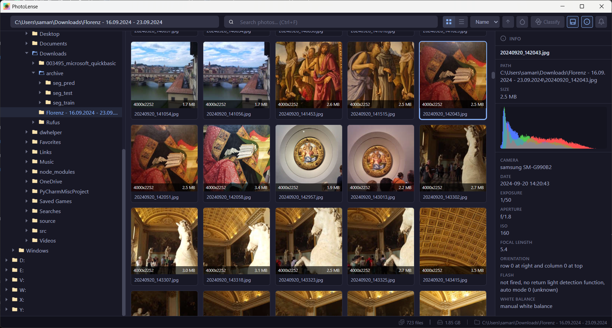

<p align="center">
  
</p>

<h1 align="center">PhotoLense</h1>

<p align="center">
  <strong>Desktop photo manager with on-device AI classification</strong>
</p>

<p align="center">
  <a href="https://github.com/srad/PhotoLense/releases"></a>
  <a href="https://github.com/srad/PhotoLense/blob/main/LICENSE"></a>
  
  
  
  
  
  <a href="https://github.com/srad/PhotoLense/stargazers"></a>
</p>

<p align="center">
  Browse your filesystem, view photos with EXIF metadata, and classify images into categories using on-device AI models &mdash; no cloud, no API keys, fully private.
</p>

---

<!-- Replace with an actual screenshot of your app -->
<p align="center">
  
  <br />
  <em>Screenshot placeholder &mdash; add your screenshot to <code>docs/screenshot.png</code></em>
</p>

---

## Highlights

- **AI-Powered Classification** &mdash; Run ConvNeXt V2 or MobileNetV3 models locally via ONNX Runtime with GPU acceleration (DirectML / CoreML / CUDA)
- **Find Similar Photos** &mdash; Cosine similarity search on model embeddings powered by [sqlite-vec](https://github.com/asg017/sqlite-vec)
- **Group by Color** &mdash; Organize photos by dominant color using CIELAB color space with Fixed Palette or K-Means clustering
- **EXIF Metadata Panel** &mdash; Camera make/model, exposure, aperture, ISO, GPS, and more
- **Blazing Fast Browsing** &mdash; Lazy-loaded thumbnails via `IntersectionObserver`, handles thousands of images without freezing
- **100% Offline** &mdash; Everything runs on your machine. No cloud. No telemetry.

## Features

### Photo Browsing
- **Grid view** and **List view** toggle
- Lazy-loaded thumbnails &mdash; only generates thumbnails for photos visible in the viewport
- Sort by name, size, or date (ascending/descending)
- Real-time filename and tag search
- File watcher for auto-refresh when files change externally (debounced ~300ms)
- Tag filtering with multi-select dropdown

### AI Classification
- **Models:** ConvNeXt V2 Base/Large (ImageNet-22K, 384x384) and MobileNetV3 Large (ImageNet-1K, 224x224)
- **Runtime:** [ort](https://github.com/pykeio/ort) (ONNX Runtime) with GPU acceleration
- Automatic model download on first use
- Top-K predictions with confidence scores
- Optional auto-organize: move or copy images into subfolders by predicted class
- Embeddings stored in SQLite for similarity search

### Find Similar
- Select a photo and find visually similar images using cosine similarity on model embeddings
- Non-blocking background indexing with progressive results
- Adjustable similarity threshold via toolbar slider

### Group by Color
- Organize photos by dominant color in CIELAB color space
- **Fixed Palette** or **K-Means Clustering** (via [kentro](https://crates.io/crates/kentro)) with configurable cluster count

### EXIF Metadata
- Toggle-able info panel with camera details
- Supports: camera make/model, date taken, exposure time, aperture, ISO, focal length, dimensions, orientation, GPS coordinates, flash, white balance, software
- Histogram display

## Architecture

**Backend (Rust):** Tauri commands expose filesystem operations, thumbnail generation, EXIF parsing, and ML inference. The classifier uses ONNX Runtime (via `ort`) with ImageNet normalization (NCHW format, softmax post-processing). Embeddings are stored in sqlite-vec for cosine similarity search. Heavy tasks (thumbnails, color extraction) are parallelized with `rayon`.

**Frontend (React + TypeScript):** State managed via `useReducer` + React Context. No external UI libraries. Thumbnails load lazily per-item using `IntersectionObserver` with an in-memory cache.

## Tech Stack

| Layer | Technology |
|-------|-----------|
| Framework | [Tauri 2](https://tauri.app/) |
| Frontend | React 18, TypeScript 5.6, Vite 6 |
| Backend | Rust (2021 edition) |
| ML Runtime | [ort](https://github.com/pykeio/ort) (ONNX Runtime &mdash; DirectML, CoreML, CUDA) |

## Getting Started

### Prerequisites

- [Node.js](https://nodejs.org/) v18+
- [Rust](https://rustup.rs/) (stable)
- [Tauri CLI prerequisites](https://tauri.app/start/prerequisites/) for your platform

### Install & Run

```bash
# Clone the repository
git clone https://github.com/srad/PhotoLense.git
cd PhotoLense

# Install frontend dependencies
npm install

# Run in development mode
npm run tauri dev

# Build for production
npm run tauri build
```

## How Classification Works

1. Open a folder and click **Classify** in the toolbar
2. Select a model (MobileNetV3 Large, ConvNeXt Base, or ConvNeXt Large) and configure options (top-K, organize, GPU)
3. Click **Start Classification**
4. The app downloads the ONNX model (first time only), loads it via ONNX Runtime, then for each image:
   - Resizes and center-crops to the model's input size (224x224 or 384x384)
   - Normalizes with ImageNet mean/std (NCHW tensor)
   - Runs inference and applies softmax for top-K class predictions
   - Stores L2-normalized logit embeddings in sqlite-vec for similarity search
5. If "Organize" is enabled, images are moved or copied into subfolders named by their top predicted class

## Cross-Platform

PhotoLense runs on **Windows**, **macOS**, and **Linux**. ONNX Runtime binaries are downloaded automatically during build. Drive listing uses the Windows API on Windows and falls back to `/` on Unix systems.

## Contributing

Contributions are welcome! Feel free to open an issue or submit a pull request.

1. Fork the repository
2. Create your feature branch (`git checkout -b feature/my-feature`)
3. Commit your changes (`git commit -m 'Add my feature'`)
4. Push to the branch (`git push origin feature/my-feature`)
5. Open a Pull Request

## License

PolyForm Noncommercial License 1.0.0
